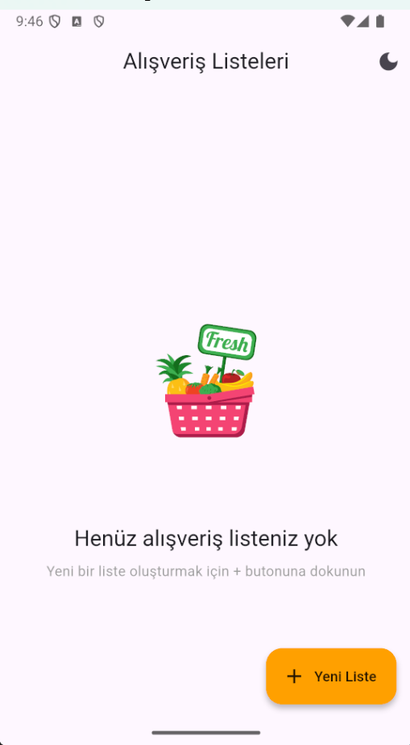
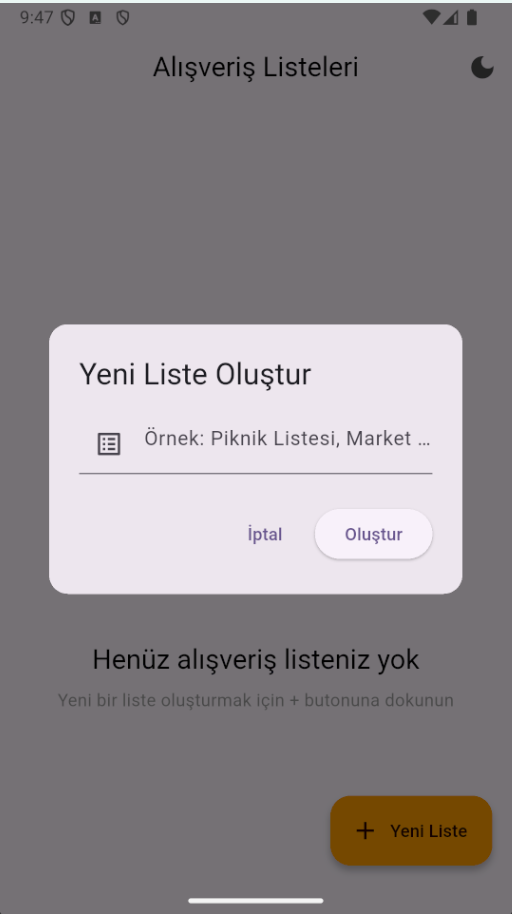
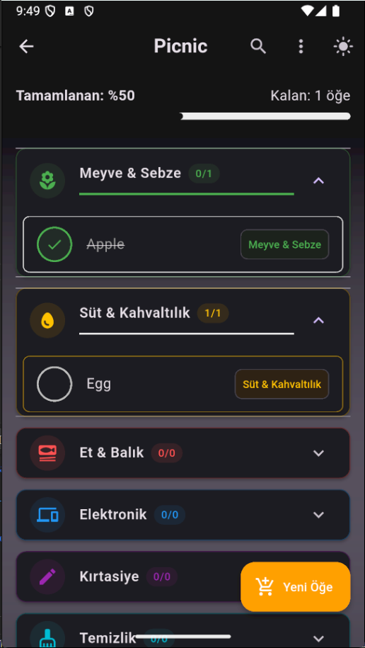

# 🛒 Shopping List App

A modern shopping list application built with Flutter that helps users manage their shopping lists efficiently.

## ✨ Features

- 📝 Create multiple shopping lists
- 📋 Categorize items by type (Groceries, Electronics, etc.)
- ✅ Mark items as purchased
- 🎨 Customizable themes (Light/Dark mode)
- 💾 Local data persistence
- 🔄 Undo deleted items
- 📊 List completion progress tracking
- 🎯 Category-based organization
- ⚡ Smooth animations and transitions

## 🚀 Technologies Used

- **Flutter:** UI framework for building natively compiled applications
- **Provider:** State management solution
- **SharedPreferences:** Local data persistence
- **Lottie:** High-quality animations
- **Flutter Slidable:** Swipe actions for list items
- **Flutter Staggered Animations:** Beautiful staggered animations
- **Animated Text Kit:** Text animations
- **Intl:** Internationalization and formatting

## 📱 Screenshots

<table>
  <tr>
    <td></td>
    <td></td>
  </tr>
  <tr>
    <td></td>
    <td></td>
  </tr>
</table>

## 🛠️ Getting Started

### Prerequisites

- Flutter (Version 3.x or higher)
- Dart (Version 3.x or higher)
- Android Studio / VS Code
- Android SDK / Xcode (for iOS development)

### Installation

1. Clone this repository:
```bash
git clone https://github.com/ismailhakkii/shopping_list.git
```

2. Navigate to project directory:
```bash
cd shopping_list
```

3. Install dependencies:
```bash
flutter pub get
```

4. Run the app:
```bash
flutter run
```

## 📦 Dependencies

```yaml
dependencies:
  flutter:
    sdk: flutter
  provider: ^6.1.1
  shared_preferences: ^2.2.2
  flutter_slidable: ^4.0.0
  flutter_staggered_animations: ^1.1.1
  animated_text_kit: ^4.2.3
  lottie: ^2.7.0
  intl: ^0.20.1
```

## 🏗️ Project Structure

```
lib/
├── controllers/         # Business logic
├── models/             # Data models
├── providers/          # State management
├── views/             # UI screens
├── widgets/           # Reusable UI components
└── main.dart          # App entry point
```

## ⭐ Show your support

Give a ⭐️ if this project helped you!

## 📝 Notes

- This app uses local storage to persist data
- Supports both light and dark themes
- Built with Flutter's latest features and best practices